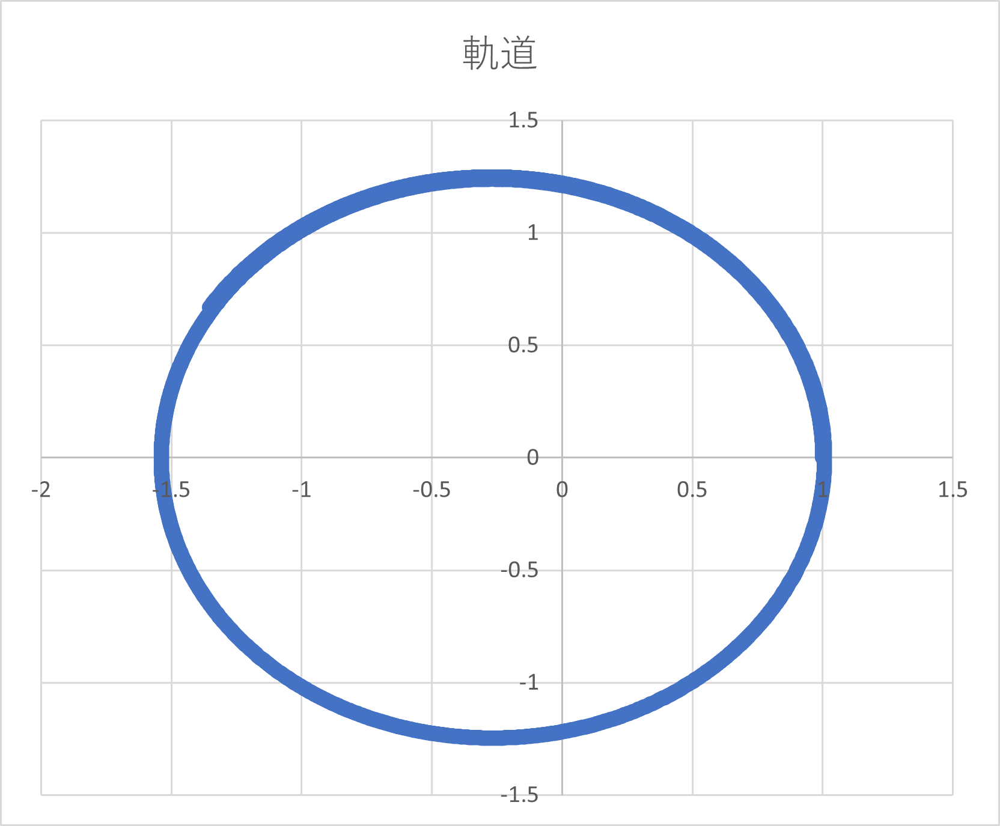

# nadesiko-kidou ー なでしこ軌道 ー

Orbital mechanics with nadesiko language. Because why not.

<p align="center">
  
</p>

#### 環境
```bash
> cnako3 -v
3.2.5
```

## Solving initial value problem（初期値問題の解法）

ファイル：「main_twobody.nako3」

#### 実行

```bash
> cnako3 ./twobody_problem.nako3
```

#### 解説

Define the equations of motion as

```nadesiko
関数　二体問題（状態、今何時、重力定数）
	# 半径を計算
	半径 = (状態[0]^2 + 状態[1]^2 + 状態[2]^2)^0.5
	# 右辺のリストを作成
	右辺 = [0.0, 0.0, 0.0, 0.0, 0.0, 0.0]

	# 位置の微分＝速度
	右辺[0] = 状態[3]
	右辺[1] = 状態[4]
	右辺[2] = 状態[5]
	# 速度の微分＝加速度
	右辺[3] = -重力定数/半径^3 * 状態[0]
	右辺[4] = -重力定数/半径^3 * 状態[1]
	右辺[5] = -重力定数/半径^3 * 状態[2]

	# 戻り値
	それは右辺
ここまで
```

RK4 is implemented as 

```nadesiko
関数　ルンゲクッタ法4次（初期状態、経過時間、ステップ数、パラメータ）
	# 初期化
	状態0 = 初期状態
	今何時 = 0.0
	d時間 = 経過時間 / ステップ数
	解 = [状態0]
	#状態1 = []
	x_length = 初期状態の配列要素数

	インデックスを0からステップ数-1まで繰り返す
		# k1 を計算
		状態微分_k1 = 二体問題（状態0、今何時、パラメータ）

		# k2 を計算 
		状態_k2 = []
		jを０からx_length-1まで繰り返す
			状態_k2@j = 状態0@j + d時間/2 * 状態微分_k1@j
		ここまで
		状態微分_k2 = 二体問題（状態_k2、今何時+d時間/2、パラメータ）

		# k3 を計算
		状態_k3 = []
		jを０からx_length-1まで繰り返す
			状態_k3@j = 状態0@j + d時間/2 * 状態微分_k2@j
		ここまで
		状態微分_k3 = 二体問題（状態_k3、今何時+d時間/2、パラメータ）

		# k4 を計算
		状態_k4 = []
		jを０からx_length-1まで繰り返す
			状態_k4@j = 状態0@j + d時間/2 * 状態微分_k3@j
		ここまで
		状態微分_k4 = 二体問題（状態_k4、今何時+d時間、パラメータ）
		

		# 状態をアップデート
		状態1 = []
		jを０からx_length-1まで繰り返す
			状態1@j = 状態0@j + d時間/6 * (状態微分_k1@j + 2*状態微分_k2@j + 2*状態微分_k3@j + 状態微分_k4@j)
		ここまで

		#解@インデックス = 状態1
		解に状態1を配列追加。

		「解」を表示
		解を表示

		# 時間と状態を上書き
		状態0 = 状態1
		今何時 = 今何時 + d時間
	ここまで

	# 戻り値
	それは解
ここまで
```

Using this, solve the initial value problem (IVP) as

```
重力定数 = 1.0
初期状態 = [1.0, 0.0, 0.0, 0.0, 1.0, 0.0]
今何時 = 0.0

経過時間 = 2*3.141592
ステップ数 = 500
解 = ルンゲクッタ法4次（初期状態、経過時間、ステップ数、重力定数）

「完了！」と表示
```

Export output as csv

```nadesiko
!『plugin_csv』を取り込む

# 実行結果を保存
解を表CSV変換して「{マイドキュメント}\nadesiko-kidou\二体問題_結果.csv」に保存。
```


